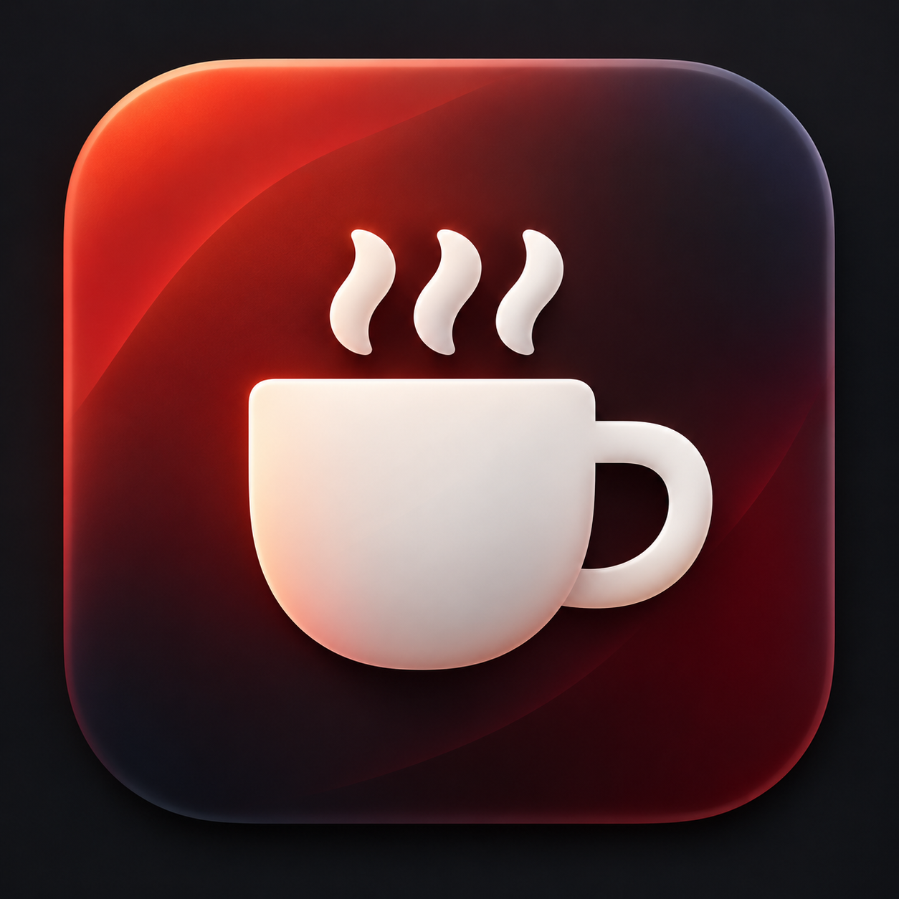
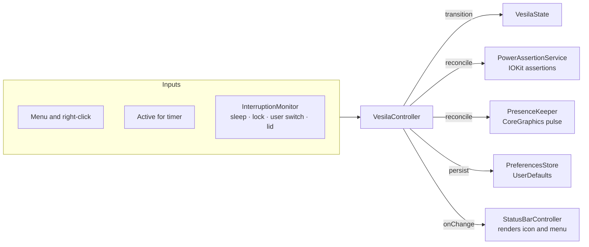

<div align="center">



# Vesila

**Stay present. Stay awake.**

A small, native macOS menu bar utility that keeps collaboration apps from marking you Away
while you're still at your Mac — and keeps your Mac awake when you need it to.


[Features](#features) ·
[How Presence works](#how-presence-works) ·
[Permissions](#permissions--privacy) ·
[Build](#building-from-source) ·
[Architecture](#architecture) ·
[FAQ](#faq--troubleshooting)

</div>

<br>

A lot of real work happens with your hands off the keyboard: reading documentation, reviewing a
pull request, following a long build, thinking a problem through. Idle detection can't tell the
difference, so apps such as Microsoft Teams flip your status to **Away** while you're sitting right
there. Vesila lives in the menu bar and, when you switch it on, keeps macOS from reporting you as
idle — without moving your cursor, clicking, or typing anything. It can also keep your Mac from
going to sleep.

<!-- Add Vesila menu screenshot here -->

## Why Vesila?

Idle detection measures input, not presence. You are still working when you're:

- reading documentation or a long document
- reviewing code
- watching a long-running build, test run, or deployment
- following a meeting or a presentation
- thinking

Vesila closes that gap with the smallest signal that works, and stays out of the way otherwise.

- **It only acts when you're idle.** Nothing happens while you're typing or using the mouse.
- **It's invisible.** One synthetic mouse-move at the cursor's current position. No movement,
  no clicks, no keystrokes.
- **It steps back when you do.** Sleeping, closing the lid, or switching users turns it off. Locking
  the screen does too unless **Stay Active When Locked** is on.
- **It starts clean.** Every launch begins with everything off.
- **It's genuinely native.** Swift and AppKit, no runtime dependencies, no background service.

## Features

| Control | What it does | Permission |
| --- | --- | --- |
| **Presence** | Keeps apps from marking you Away while you're idle at your Mac | Accessibility |
| **System Awake** | Prevents idle system sleep | None |
| **Stay Active When Locked** | Keeps the session running while the screen is locked; off by default | None |

### Presence

The main feature. Presence watches for *real* inactivity and only then gives macOS's idle timer a
small, invisible nudge.

- Waits for **4 minutes** of real keyboard and mouse inactivity
- Then posts one harmless synthetic `mouseMoved` event; the cursor doesn't visibly move
- Repeats every **3 minutes** for as long as you stay idle
- No clicks, no scrolling, no keystrokes
- Any real keyboard or mouse input resets the idle period
- Never mistakes its own pulses for you coming back
- Requires the macOS **Accessibility** permission

### System Awake

- Prevents **idle system sleep** while it's on
- Implemented directly with IOKit power assertions, with no `caffeinate` process
- Needs no permissions
- Affects idle sleep only: choosing Sleep or closing the lid still works as usual, and ends the
  session

### Stay Active When Locked

- Off by default, remembered across launches, and always available, even when System Awake is off
- When off, locking the screen ends the session as usual
- When on, locking the screen keeps Presence, System Awake, and the Active for countdown running
- The Active for timer still ends the session when it runs out, even while the screen is locked
- Sleep, lid close, and switching users always end the session, regardless of this setting
- Unlocking changes nothing: a running session keeps running, and an ended one stays off
- Needs no permission and doesn't change the menu bar icon
- Isn't part of the combination that [right-click](#right-click-quick-toggle) restores

## How Presence works

```text
last real input
│
├───────── 4 min of real inactivity ─────────┤ pulse
                                             ├──── 3 min ────┤ pulse
                                                             ├──── 3 min ────┤ pulse  ···
```

Type, click, or move the mouse at any point and the clock starts over: the next pulse is four
minutes of real inactivity away.

**The pulse.** A single `mouseMoved` event posted at the cursor's current position. macOS counts it
as input, so the system idle timer resets — the timer that idle detection in apps like Teams relies
on — but nothing on screen changes. If Vesila can't read the cursor position, it skips the pulse
rather than guess a position that would visibly move the pointer.

**Telling you apart from itself.** Because the pulse resets the system idle timer, that timer alone
can't distinguish Vesila's pulse from you returning. Watching individual events would need an event
tap and the Input Monitoring permission, so Vesila doesn't do that. Instead it remembers when it
last pulsed: if the most recent input lines up with its own pulse, the input is attributed to
Vesila, and your real idle time keeps counting.

<details>
<summary><strong>Implementation details</strong></summary>

- Idle time comes from `CGEventSource.secondsSinceLastEventType(.combinedSessionState, eventType:)`
  for any input event type.
- The pulse is a `.mouseMoved` `CGEvent` from a `.hidSystemState` source, posted to
  `.cghidEventTap` and tagged through `eventSourceUserData` so it's identifiable when inspecting
  event streams.
- Input within one second of a pulse is attributed to the pulse.
- Vesila checks roughly every 15 seconds, so pulse timing is accurate to within one check.
- Accessibility is re-checked on every check. If the permission is revoked, Presence switches off
  within seconds, while System Awake and the session timer carry on.
- A pulse that can't be posted is retried one interval later.

</details>

## Using Vesila

Vesila is menu-bar-only: no Dock icon and no main window. **Left-click** the cup to open the menu:

- a status card showing **Inactive**, the time remaining, or **Until turned off**
- **Presence** and **System Awake** switches
- **Stay Active When Locked** switch below the Presence and System Awake cards
- **Active for** duration options
- **About Vesila** and **Quit Vesila** (<kbd>⌘</kbd> <kbd>Q</kbd> works while the menu is open)

On first launch, a short welcome window introduces both features and offers to enable
Accessibility. Granting it there is optional. The window comes back on each launch until you press
**Continue**.

### Menu bar icon

The cup tells you what's running at a glance: **fill means Presence, steam means System Awake.**

<table>
  <tr>
    <td align="center" width="150">
      <picture>
        <source media="(prefers-color-scheme: dark)" srcset=".github/readme/vesila-idle-dark.svg">
        
      </picture>
      <br><strong>Inactive</strong>
      <br><sub>empty cup, no steam</sub>
    </td>
    <td align="center" width="150">
      <picture>
        <source media="(prefers-color-scheme: dark)" srcset=".github/readme/vesila-presence-dark.svg">
        
      </picture>
      <br><strong>Presence</strong>
      <br><sub>filled cup, no steam</sub>
    </td>
    <td align="center" width="150">
      <picture>
        <source media="(prefers-color-scheme: dark)" srcset=".github/readme/vesila-awake-dark.svg">
        
      </picture>
      <br><strong>System Awake</strong>
      <br><sub>empty cup, steam</sub>
    </td>
    <td align="center" width="150">
      <picture>
        <source media="(prefers-color-scheme: dark)" srcset=".github/readme/vesila-both-dark.svg">
        
      </picture>
      <br><strong>Both</strong>
      <br><sub>filled cup, steam</sub>
    </td>
  </tr>
</table>

Stay Active When Locked doesn't change the icon. In the menu bar the icons are template images, so
macOS draws them to match the menu bar's appearance.

### Active for

Presence and System Awake share a single session with one timer.

| Option | Session length |
| :---: | --- |
| `30m` | 30 minutes |
| `1h` | 1 hour (default) |
| `2h` | 2 hours |
| `3h` | 3 hours |
| `5h` | 5 hours |
| `∞` | Until turned off |

- The session starts when the first of the two features turns on. Turning the other one on or off
  later doesn't restart it.
- When the time runs out, both features turn off.
- Picking a duration mid-session restarts the countdown from that moment, so re-selecting the
  current option gives you the full duration again.
- `∞` removes the countdown entirely.
- Picking a duration while Vesila is off just sets it for next time. Your choice is remembered
  across launches.

### Right-click quick toggle

> [!TIP]
> Right-click the menu bar icon to switch Vesila on or off without opening the menu.

- **While active**, right-click remembers the current Presence / System Awake combination and turns
  both off.
- **While inactive**, it restores the last combination that was on. Until you've used another one,
  that's **Presence + System Awake**.

A restored session uses your current Active for setting. Stay Active When Locked keeps its own
setting and isn't part of the combination. If the combination includes Presence but Accessibility
hasn't been granted, Vesila restores the rest and asks for access.

### When Vesila turns itself off

Vesila ends the session, switching off both Presence and System Awake, when:

- the screen locks, unless Stay Active When Locked is on
- the Mac goes to sleep
- the laptop lid closes, including with an external display attached
- you switch to another user
- the Active for timer runs out

When you come back (wake, lid open), **Vesila stays off**. It never silently switches itself back
on; a right-click brings back your last combination.

Display sleep on its own doesn't end the session. If display sleep locks your screen, that lock ends
the session unless Stay Active When Locked is on. Unlocking changes nothing: a running session
keeps running, and an ended one stays off.

Vesila also always launches with both features off, and quitting releases every power assertion.

## Permissions & privacy

| Permission | Needed? | Why |
| --- | --- | --- |
| **Accessibility** | For Presence only | To post the harmless synthetic mouse-move |
| **Input Monitoring** | No | Vesila never reads keystrokes or installs an event tap |
| **Screen Recording** | No | Vesila never looks at your screen |

System Awake and Stay Active When Locked need no permission at all.

**Granting Accessibility.** If you turn on Presence without access, Vesila explains why it's needed
and offers to open **System Settings › Privacy & Security › Accessibility**. Enable Vesila there and
Presence turns on automatically; Vesila watches for the grant for up to three minutes. If access is
later revoked, Presence switches itself off and System Awake keeps running.

**Privacy.** Everything Vesila does happens on your Mac.

- **No networking code.** No accounts, analytics, telemetry, cloud service, or update checks.
- **Minimal inputs.** Vesila reads how long it's been since the last input (a single number from
  macOS), the cursor position so the pulse lands where the cursor already is, the lid state, and
  the system's sleep, lock, and user-switch notifications.
- **Minimal storage.** Four preferences in `UserDefaults`: the Active for duration, Stay Active When
  Locked, the right-click combination, and whether you've completed the welcome window. Whether a
  feature is on is never stored.
- **No special entitlements.** Release builds are signed with the Hardened Runtime and an empty
  entitlements file.

## Installation

> [!NOTE]
> Signed and notarized releases are published on [GitHub Releases](https://github.com/szryldrm/vesila-mac/releases).
> The current release is **Vesila 1.0.2**.

Once it's installed:

1. Open Vesila. A cup appears in the menu bar, and a welcome window explains both features.
2. If you plan to use Presence, click **Enable Accessibility** and switch Vesila on in System
   Settings.
3. Left-click the cup to turn on what you need, or right-click to toggle.

## Building from source

You need macOS 14 or later and a Swift 6 toolchain: Xcode 16 or later, or just the Command Line
Tools. There's no Xcode project; everything builds with Swift Package Manager.

```sh
xcode-select --install   # only if you have neither Xcode nor the Command Line Tools
```

From the repository root:

```sh
./Scripts/build_app.sh
open .build/app/Vesila.app
```

`build_app.sh` compiles a release build and assembles **`.build/app/Vesila.app`**. Along the way it:

- copies `Packaging/Info.plist`, where `LSUIElement` makes Vesila a menu-bar-only agent app
- stamps the version and build number from `VERSION` and `BUILD_NUMBER`
- bundles the status bar icons
- generates `Vesila.icns` from `app-icon.png`

The result is ad-hoc signed rather than Developer ID signed, and built for your Mac's architecture.
It's meant for local use. To keep it, copy it to Applications:

```sh
ditto .build/app/Vesila.app /Applications/Vesila.app
```

For quick iteration you can skip the bundle:

```sh
swift build
swift run
```

When launched this way, macOS attributes the Accessibility permission to your terminal app rather
than to Vesila, so use the app bundle when working on Presence.

## Running tests

```sh
./Scripts/test.sh
```

Extra arguments are passed through to `swift test`:

```sh
./Scripts/test.sh --filter Presence
```

The wrapper exists for machines with only the Command Line Tools, where plain `swift test` can't
find the Swift Testing macro plugin. Everywhere else it's harmless.

The suite has 63 tests in 9 suites, written with Swift Testing. It covers the state rules
(sessions, durations, right-click memory, Stay Active When Locked), Presence pulse timing, preference
persistence, and system integration: System Awake's power-assertion handling and the controller
wiring, using real IOKit assertions that the test process holds briefly.

## Releasing

Maintainer release tooling is intentionally kept outside the repository so signing identities,
notarization credentials, local Keychain profiles, and deployment configuration stay local.

The release process runs the full test suite, updates `VERSION` and `BUILD_NUMBER`, builds the app,
Developer ID signs it with Hardened Runtime, notarizes, staples, and verifies the app and DMG, and
produces a SHA-256 checksum. Published artifacts are uploaded to GitHub Releases.

Tracked source code must never contain signing certificates, private keys, passwords, tokens, or
notarization credentials.

## Architecture

Vesila is a single Swift package with one executable target and one test target. It has no
third-party dependencies, no Xcode project, and no web views. One rule shapes the design: **all
behavior rules live in one value type, and every change flows through one controller.**



- **`VesilaState`** is a plain value type holding every rule: sessions, durations, right-click
  memory, Stay Active When Locked.
- **`VesilaController`** is the single owner of that state. Every input goes through it: apply the
  transition, reconcile the services, persist preferences, notify the UI.
- **`PresenceKeeper`** tracks real idle time and posts the activity pulse.
- **`PowerAssertionService`** acquires and releases the IOKit assertions idempotently.
- **`InterruptionMonitor`** reports sleep, screen lock, user switching, and lid close.
- **`StatusBarController`** owns the status item and menu. It renders state and forwards clicks,
  and holds no state of its own.

Because services are reconciled against the state rather than toggled ad hoc, the invariants hold
by construction: System Awake off means no power assertion, no session means no timer, and launch
or any interruption leaves both features off. The one exception is a screen lock while Stay Active
When Locked is on: it keeps the running session, but still cancels a pending Presence activation.
If macOS refuses a power assertion, System Awake shows as off. It is never displayed as on without
an assertion behind it.

<details>
<summary><strong>Platform APIs</strong></summary>

| Concern | Framework and API |
| --- | --- |
| Menu bar UI | AppKit: `NSStatusItem`, a custom `NSView`-based menu |
| Presence pulse and idle time | CoreGraphics: `CGEvent`, `CGEventSource` |
| System awake | IOKit: `IOPMAssertionCreateWithName` |
| Lid state | IOKit: `IOPMrootDomain` clamshell state |
| Sleep, lock, user switching | `NSWorkspace` and distributed notifications |
| Accessibility check | ApplicationServices: `AXIsProcessTrusted` |
| Preferences | `UserDefaults` |
| Logging | `OSLog` |
| Tests | Swift Testing |

</details>

<details>
<summary><strong>Source layout</strong></summary>

```text
Sources/Vesila/
├── App/          AppDelegate, VesilaController, configuration
├── State/        VesilaState (the rules), PreferencesStore
├── System/       Presence, power assertions, interruptions, lid, Accessibility
├── Menu/         StatusBarController, menu views, status icon library
├── Windows/      Welcome and About windows
└── Resources/    The four status bar icons (SVG)
Tests/VesilaTests/  State, Presence timing, preferences, system integration
Scripts/            build_app.sh, test.sh
Packaging/          Info.plist, entitlements
```

Maintainer signing, notarization, and deployment tooling is local-only and intentionally untracked.

</details>

## Requirements

- **macOS 14 Sonoma** or later
- **Accessibility** permission, for Presence only
- **Swift 6 toolchain** to build from source: Xcode 16 or later, or the Command Line Tools

## FAQ & troubleshooting

<details>
<summary><strong>Does Vesila move my cursor, click, or type?</strong></summary>

No. Presence posts a single mouse-move event at the cursor's current position, so the pointer stays
exactly where it is. Vesila never clicks, scrolls, or sends keystrokes.

</details>

<details>
<summary><strong>Presence won't turn on, or keeps asking for Accessibility.</strong></summary>

Presence can't run without Accessibility. Choose **Open Accessibility Settings** in Vesila's prompt,
or **Enable Accessibility** in the welcome window, then switch Vesila on. Presence activates
automatically once access is granted.

</details>

<details>
<summary><strong>Accessibility is enabled, but Vesila still asks for it.</strong></summary>

This is common with locally built copies. macOS ties the permission to the app's code signature, so
a rebuilt, ad-hoc-signed Vesila can look like a different app. Remove Vesila from the Accessibility
list with the <strong>−</strong> button, then grant access again.

</details>

<details>
<summary><strong>My status still goes Away.</strong></summary>

Check the icon first. An empty cup means Presence is off: a screen lock, sleep, lid close, user
switch, or the Active for timer may have ended the session.

Vesila doesn't talk to Teams or any other app. It only keeps macOS's system idle time from growing.
If an app determines your status some other way, Presence can't influence it.

</details>

<details>
<summary><strong>Does System Awake keep my Mac awake with the lid closed?</strong></summary>

No. System Awake prevents idle sleep only, and closing the lid ends the Vesila session, even in
clamshell mode with an external display.

</details>

<details>
<summary><strong>How can I confirm System Awake is working?</strong></summary>

Vesila's power assertions are visible to `pmset`:

```sh
pmset -g assertions | grep Vesila
```

You should see `Vesila — System Awake`.

</details>

<details>
<summary><strong>Where's the Dock icon, and how do I quit?</strong></summary>

There isn't one; Vesila is a menu bar agent app. Quit from the menu with **Quit Vesila**, or press
<kbd>⌘</kbd> <kbd>Q</kbd> while the menu is open.

</details>

<details>
<summary><strong>Can Vesila start at login?</strong></summary>

There's no built-in option yet. You can add it yourself under **System Settings › General › Login
Items**. It will launch with both features off, as always.

</details>

<details>
<summary><strong>How can I see what Vesila is doing?</strong></summary>

Vesila logs interruptions and errors to the unified log:

```sh
log stream --level info --predicate 'subsystem == "com.sezeryildirim.vesila"'
```

</details>

## Project status

The features described above are implemented and covered by the test suite.

- **Version:** tracked in [`VERSION`](VERSION)
- **Latest release:** [Vesila 1.0.2](https://github.com/szryldrm/vesila-mac/releases/tag/v1.0.2), signed and notarized
- **License:** All rights reserved. See [LICENSE](LICENSE).

## Disclaimer

Vesila is an independent project and is not affiliated with or endorsed by Microsoft. Microsoft
Teams is a trademark of the Microsoft group of companies.

Vesila is meant to keep your status accurate while you're genuinely at your Mac, not to simulate
work or get around workplace monitoring. It switches itself off when you put your Mac to sleep or
close the lid, and by default when you lock your screen. Please use it in line with your
organization's policies.
